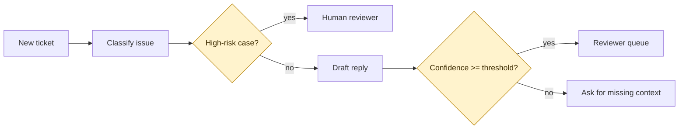
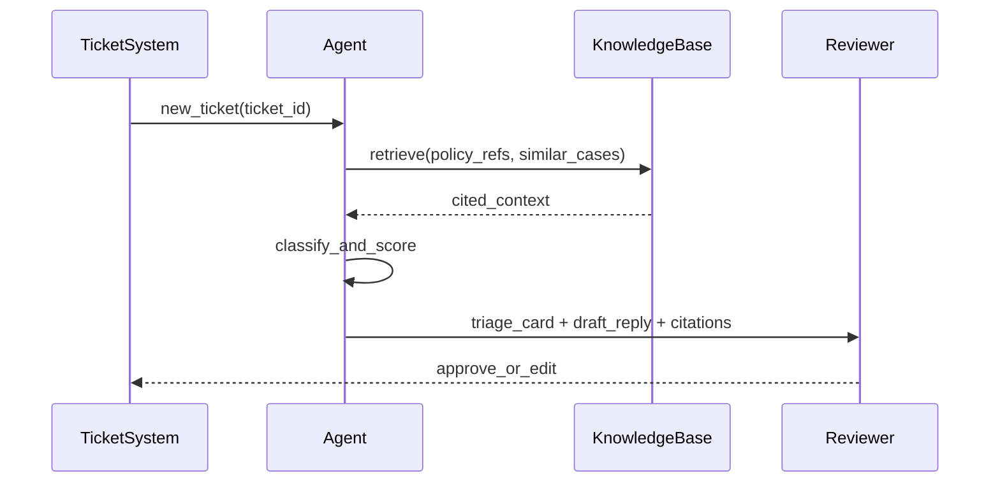
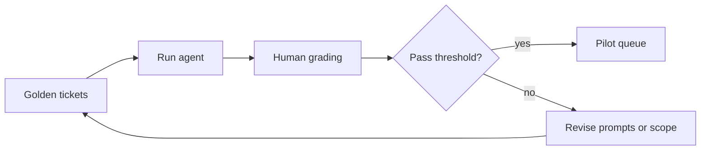

# Support Triage Agent - Sample PRD

Status: DONE_WITH_GAPS

```yaml
product_type: ai_agent
secondary_product_type: b2b_saas_ops
output_profile: multi
```

```yaml
research_pack:
  - evidence_type: support_ticket
    source_ref: user_supplied_ticket_notes_placeholder
    freshness: 2026-05
    confidence: medium
    product_decision_link: triage_scope
```

```yaml
out_of_scope:
  - tech_stack
  - pricing
  - org_staffing
```

```yaml
audience_split:
  enabled: true
  packs: [agent_behavior_spec, eval_plan, human_review_playbook, risk_brief]
```

```yaml
diagrams_generated:
  - section: 4
    subtype: flowchart
    purpose: agent_autonomy_boundary
  - section: 5
    subtype: sequenceDiagram
    purpose: ticket_triage_sequence
  - section: 10
    subtype: flowchart
    purpose: eval_loop
    export_note: keep_mermaid_source_for_word_pdf_confluence
```

## Summary

Support Triage Agent classifies incoming customer tickets, drafts a first
response, and routes high-risk cases to a human reviewer. The MVP is limited to
read-only triage and draft generation. It cannot close tickets, issue refunds,
change account status, or message customers without review.

## Project Positioning

The product reduces first-response delay for support teams that already receive
more tickets than agents can sort during peak hours. The first value moment is a
queue view where each new ticket has category, urgency, confidence, source
citations, and a suggested next action.

## Market Strategy

Target users are support leads and frontline reviewers in teams with repeatable
ticket categories. The first release is not a general customer-service agent.
It is a triage assistant for teams willing to review drafts before customer
contact.

## Agent Workflow

### Agent autonomy boundary



The agent may label tickets, summarize context, and draft replies. A human must
approve replies, refund suggestions, policy exceptions, or account actions.

## Functional Requirements

### Ticket triage sequence



- `ticket_category`: billing, account_access, product_bug, refund_request, other.
- `risk_level`: low, medium, high.
- `confidence_score`: number from 0 to 1 shown to reviewers.
- `requires_human_review`: always true for customer-facing replies in MVP.
- `source_citations`: policy or prior-ticket references used in the draft.

## Art and Design Requirements

Use a dense reviewer console rather than a marketing-style page. Each triage card
needs visible risk level, confidence, cited sources, suggested action, and edit
history. Color should flag risk without hiding text in Word or PDF export.

## Math or Business Model

Assumption-backed: reducing manual sorting time by 30 percent creates enough
value for a pilot. Owner: Support Lead. Deadline: before pilot kickoff.

## Compliance and Risk

Main risks are hallucinated policy claims, stale knowledge-base retrieval,
permission misuse, and reviewers over-trusting confident drafts. The PRD requires
citations, human approval, audit logs, and golden-task evals before pilot launch.

## Technical Considerations

This PRD does not select a model, vector database, or ticketing platform. It
defines semantic contracts only: ticket input, source retrieval, draft output,
review decision, and audit event.

## KPI and Success Metrics

### Eval loop



- Triage accuracy: target to_be_confirmed.
- Unsafe draft rate: 0 P0 incidents in pilot.
- Reviewer edit distance: baseline pending.
- First-response time reduction: target to_be_confirmed.

## Milestones

1. Define ticket taxonomy and golden-ticket set.
2. Draft triage card and reviewer workflow.
3. Run offline eval.
4. Pilot on one queue with human approval required.

## Assumptions

- Support Lead owns the ticket taxonomy and will approve it before build.
- Legal/Compliance owns policy-sensitive response boundaries before pilot.

## Non-goals

- No autonomous customer replies in MVP.
- No refund execution.
- No account mutation.
- No model or vendor selection in this PRD.

## Sources

- `user_supplied_ticket_notes_placeholder` marks where real ticket evidence
  should be linked in a live PRD.

## Known Gaps

- Real ticket corpus is not attached.
- Eval pass thresholds need owner approval.
- Word/PDF/Confluence export should be checked after rendered diagrams are available.
