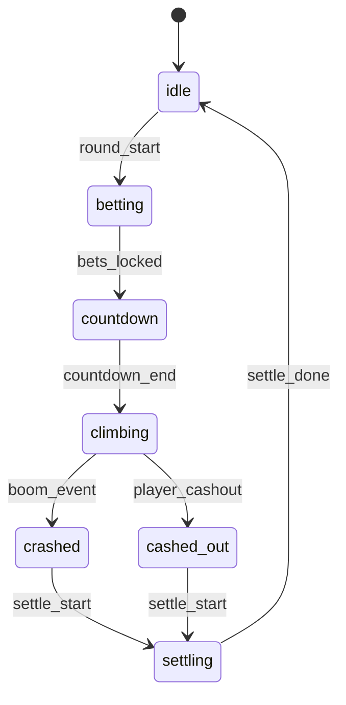
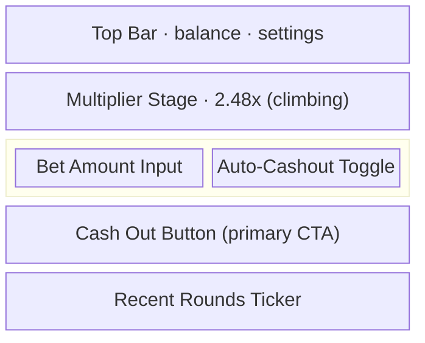

# SkyRush — Sample PRD Output

Status: DONE_WITH_GAPS

```yaml
product_type: game_interactive
secondary_product_type: null
output_profile: confluence
```

```yaml
research_pack: []
```

```yaml
out_of_scope:
  - tech_stack
  - payment_channels
  - infra_deployment
```

```yaml
diagrams_generated:
  - section: 4
    subtype: stateDiagram-v2
    purpose: core_game_loop
    export_note: attach_skyrush-core-loop.png_and_keep_mermaid_source
  - section: 6
    subtype: block-beta
    purpose: main_screen_wireframe
    export_note: attach_skyrush-main-screen.png_and_keep_mermaid_source
```

## Summary
SkyRush is a mobile-first crash game designed to convert short-session traffic into repeat betting behavior. The MVP prioritizes fast entry, low-friction betting, and visible cash-out tension.

## Gameplay Flow

### Core Game Loop



## Functional Requirements
- `bet_amount`: player stake entered before round start
- `auto_cashout_multiplier`: optional automatic cashout threshold
- `round_state`: `countdown | active | crashed | settled`
- `cashout_state`: `pending | success | failed`

## Art and Design Requirements
- modern neon visual direction with strong contrast
- clear multiplier focus at center stage
- separate animation treatment for countdown, climb, and crash
- win/loss audio layers kept distinct from core game logic requirements

### Main Screen Wireframe



## Known Gaps
- RTP pending math table
- max multiplier pending risk review
- jurisdiction-specific compliance pending legal confirmation
