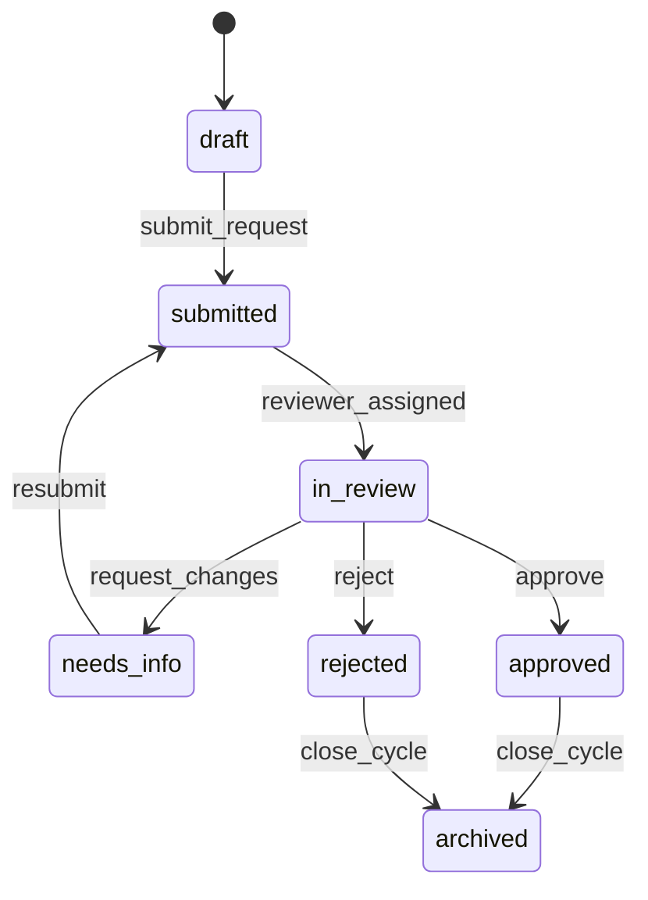
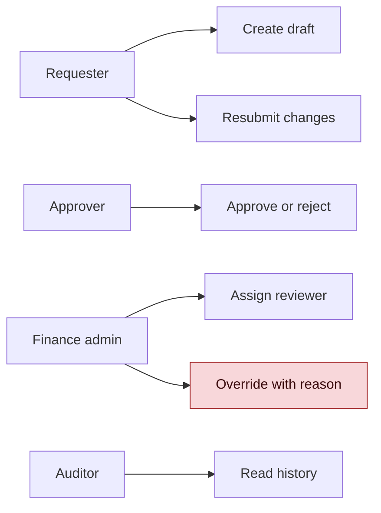

# Finance Approval Queue - Sample PRD

Status: DONE_WITH_GAPS

```yaml
product_type: b2b_saas_ops
secondary_product_type: null
output_profile: obsidian_md
```

```yaml
research_pack: []
```

```yaml
out_of_scope:
  - pricing
  - tech_stack
  - infra_deployment
```

```yaml
audience_split:
  enabled: true
  packs: [workflow_spec, permission_matrix, support_runbook, release_brief]
```

```yaml
diagrams_generated:
  - section: 4
    subtype: stateDiagram-v2
    purpose: workflow_state_map
    export_note: keep_mermaid_source_for_confluence_if_exported
  - section: 5
    subtype: flowchart
    purpose: role_permission_map
    export_note: keep_mermaid_source_for_confluence_if_exported
```

## Summary

Finance Approval Queue replaces ad hoc spreadsheet and chat approvals with a
single queue for request intake, reviewer assignment, exception handling, and
status history. The MVP focuses on internal operations teams that approve
routine spend requests.

## Project Positioning

The product is an operations tool, not a finance system of record. It gives
requesters and approvers one visible state per request while leaving accounting,
payment, and vendor-management systems outside this PRD.

## Market Strategy

Target teams already manage approvals through shared spreadsheets, chat threads,
and manual reminders. The first value moment is seeing every pending request with
owner, amount band, due date, and blocked reason.

## Product Flow

### Workflow state map



Each request has exactly one `approval_state`. Status history is append-only and
must show who changed state, when, and why.

## Functional Requirements

### Role and permission map



- `approval_state`: draft, submitted, in_review, needs_info, approved, rejected, archived.
- `request_amount_band`: low, medium, high. Exact thresholds are to_be_confirmed.
- `review_due_at`: date used for reminders.
- `blocked_reason`: required when a request is in `needs_info`.
- `override_reason`: required for admin override.

## Art and Design Requirements

Use a compact work queue with sortable columns, status filters, and clear empty
states. Avoid large hero sections. Reviewers need fast scanning across amount,
age, requester, owner, and blocked reason.

## Math or Business Model

Assumption-backed: reducing approval chase time by one business day justifies the
MVP. Owner: Finance Ops Lead. Deadline: before pilot planning.

## Compliance and Risk

Approval history must be auditable. Admin override is allowed only with a reason.
This PRD does not define payment execution, accounting policy, or legal approval
rules.

## Technical Considerations

The PRD defines states, permissions, and audit behavior. It does not prescribe
framework, database, hosting, or integration vendor.

## KPI and Success Metrics

- Median approval cycle time.
- Percent of requests with an assigned reviewer within one business day.
- Percent of requests reopened due to missing information.
- Number of override actions per month.

## Milestones

1. Confirm roles and approval states.
2. Draft queue UX and permission matrix.
3. Pilot with one finance ops team.
4. Review cycle-time and reopened-request metrics.

## Assumptions

- Finance Ops Lead owns state definitions.
- Security owner approves role-permission matrix before build.
- Pilot team can supply one month of baseline approval-cycle data.

## Non-goals

- No payment processing.
- No accounting ledger changes.
- No vendor onboarding.
- No pricing model.

## Sources

- No research supplied in this sample. Treat business claims as assumptions.

## Known Gaps

- Amount-band thresholds are not confirmed.
- Baseline cycle-time data is not attached.
- Support runbook needs real failure cases from the pilot team.
