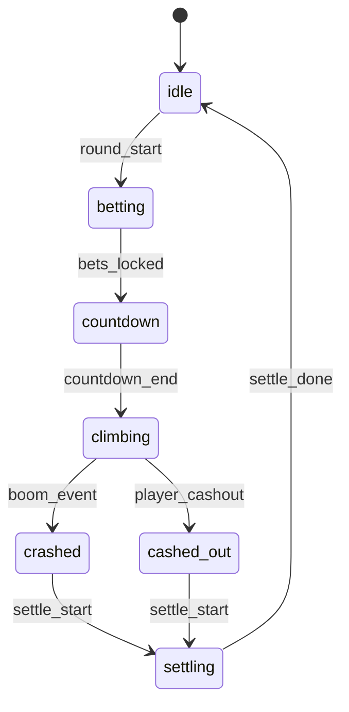

# SkyRush — GDD (Game Design Document)

```yaml
discipline_split:
  type: gdd
  source_prd: ../examples/sample-output-prd.md
  source_prd_title: SkyRush — Sample PRD Output
  generated_at: 2026-04-29T10:00:00+08:00
  sections_primary: [4, 5, 10]
  sections_crosscutting: [1, 11, 12, 13, 14]
  sections_secondary: []
  requirements_extracted: 11
  requirements_tbc: 2
```

```yaml
out_of_scope:
  - tech_stack
  - payment_channels
  - infra_deployment
```

## Overview

SkyRush is a mobile-first crash game designed to convert short-session traffic into repeat betting behavior. The MVP prioritizes fast entry, low-friction betting, and visible cash-out tension.

## Gameplay Flow

### Core Game Loop



### Requirements

| ID | Section | Description | Priority | Owner | Status |
|---|---|---|---|---|---|
| GDD-4-001 | Gameplay flow | Core loop: idle → betting → countdown → climbing → crashed/cashed_out → settling → idle | P0 | Game Design | draft |
| GDD-4-002 | Gameplay flow | `round_start` event triggers transition from idle to betting phase | P0 | Game Design | draft |
| GDD-4-003 | Gameplay flow | `bets_locked` event freezes bet entry; no changes after this point | P0 | Game Design | draft |
| GDD-4-004 | Gameplay flow | Player can trigger `player_cashout` at any point during climbing phase | P0 | Game Design | draft |
| GDD-4-005 | Gameplay flow | `boom_event` is server-authoritative; determines crash multiplier | P0 | Game Design | draft |

## Functional Requirements

| ID | Section | Description | Priority | Owner | Status |
|---|---|---|---|---|---|
| GDD-5-001 | Functional reqs | `bet_amount`: player stake entered before round start | P0 | Game Design | draft |
| GDD-5-002 | Functional reqs | `auto_cashout_multiplier`: optional automatic cashout threshold | P1 | Game Design | draft |
| GDD-5-003 | Functional reqs | `round_state` enum: `countdown \| active \| crashed \| settled` | P0 | Game Design | draft |
| GDD-5-004 | Functional reqs | `cashout_state` enum: `pending \| success \| failed` | P0 | Game Design | draft |

## KPI and Success Metrics

| ID | Section | Description | Priority | Owner | Status |
|---|---|---|---|---|---|
| GDD-10-001 | KPI | Primary KPI definition pending | `to_be_confirmed` | Game Design | draft |
| GDD-10-002 | KPI | Retention and session length targets pending | `to_be_confirmed` | Game Design | draft |

## Context

### Milestones

_No milestones defined in source PRD._

### Assumptions

_No assumptions section in source PRD._

### Non-goals

_No non-goals section in source PRD._

### Sources

_No sources section in source PRD._

## Known Gaps

- RTP pending math table
- max multiplier pending risk review

## Consolidated Requirements Table

| ID | Section | Description | Priority | Owner | Status |
|---|---|---|---|---|---|
| GDD-4-001 | Gameplay flow | Core loop: idle → betting → countdown → climbing → crashed/cashed_out → settling → idle | P0 | Game Design | draft |
| GDD-4-002 | Gameplay flow | `round_start` event triggers transition from idle to betting phase | P0 | Game Design | draft |
| GDD-4-003 | Gameplay flow | `bets_locked` event freezes bet entry; no changes after this point | P0 | Game Design | draft |
| GDD-4-004 | Gameplay flow | Player can trigger `player_cashout` at any point during climbing phase | P0 | Game Design | draft |
| GDD-4-005 | Gameplay flow | `boom_event` is server-authoritative; determines crash multiplier | P0 | Game Design | draft |
| GDD-5-001 | Functional reqs | `bet_amount`: player stake entered before round start | P0 | Game Design | draft |
| GDD-5-002 | Functional reqs | `auto_cashout_multiplier`: optional automatic cashout threshold | P1 | Game Design | draft |
| GDD-5-003 | Functional reqs | `round_state` enum: `countdown \| active \| crashed \| settled` | P0 | Game Design | draft |
| GDD-5-004 | Functional reqs | `cashout_state` enum: `pending \| success \| failed` | P0 | Game Design | draft |
| GDD-10-001 | KPI | Primary KPI definition pending | `to_be_confirmed` | Game Design | draft |
| GDD-10-002 | KPI | Retention and session length targets pending | `to_be_confirmed` | Game Design | draft |

## Completeness Summary

- Requirements extracted: 11
- to_be_confirmed items: 2 (GDD-10-001, GDD-10-002 priority)
- Mermaid diagrams carried: 1 (§4 stateDiagram-v2)
- Sections included: 3 primary + 4 crosscutting + 0 secondary
