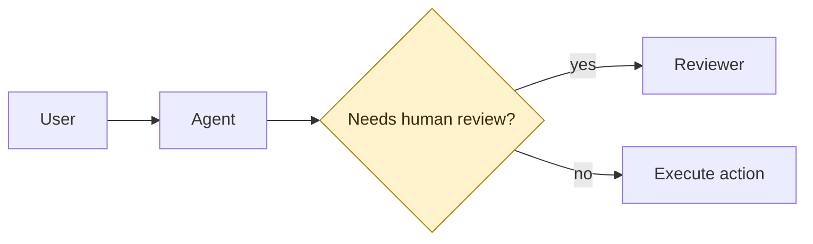

# Write PRD

Structured 5-phase PRD workflow. Accepts anything from a vague idea to a detailed brief.

## Phase 0 — Context Loading

Sources, in priority order:

1. Task-specific files supplied by user
2. Local project documents (`docs/`, `references/`, sibling PRDs)
3. Memory / knowledge base (if available in the environment)
4. User answers

### 0.0 Product type and output profile

Before detailed interrogation, classify the PRD so later questions and split
documents fit the product. If the brief clearly indicates a type, state the
classification and ask only for correction. If unclear, ask one concise
question with the closest 2–3 options.

Supported `product_type` values:

| product_type | Use for | Watch closely |
|---|---|---|
| `game_interactive` | games, gambling-like loops, interactive entertainment | math model, player flow, art/audio, compliance |
| `ai_agent` | assistants, internal agents, automation, retrieval, code/design/support agents | autonomy boundary, tools, evals, human review, audit logs |
| `b2b_saas_ops` | CRM, approval flows, admin consoles, workflow tools | roles, permissions, repeated tasks, state transitions, support |
| `data_analytics` | dashboards, reports, experiments, monitoring, decision support | metric definitions, freshness, quality, decision loop |
| `platform_marketplace` | APIs, plugins, partner networks, marketplace, B2B2C | actor incentives, onboarding, trust, compatibility |
| `consumer_growth` | apps, communities, lifecycle, referrals, memberships | activation, retention, notification boundaries, experiments |
| `content_learning` | courses, knowledge bases, AI tutors, training | outcomes, content quality, learner levels, feedback |
| `mixed` | genuinely spans 2+ types | name primary and secondary type; do not ask every pack's questions |

Also record the target `output_profile`:

| output_profile | Use when | Formatting rules |
|---|---|---|
| `obsidian_md` | User works in Obsidian or a markdown vault | relative links; optional wiki links only if requested; Mermaid inline |
| `word_docx` | User needs Word review or stakeholder comments | strict heading levels; simple tables; captions for diagrams; no HTML-only layout |
| `pdf` | User needs a frozen review/share artifact | page-friendly tables; diagram titles; keep Mermaid source if rendering is unavailable |
| `confluence` | User needs a Confluence page/import artifact | H1-H3 headings; simple tables; explicit links; diagram image attachment note plus Mermaid source |
| `multi` | User needs more than one target | optimize Markdown first, then add Word/PDF export notes |

Persist both near the top of the PRD, immediately after the H1 title and before
other metadata blocks:

```yaml
product_type: ai_agent
secondary_product_type: null
output_profile: multi
```

### 0.1 Mandatory history alignment

**Before asking any question**, sweep for prior context:

```bash
# Sibling PRDs in the repo
ls docs/prd/ 2>/dev/null

# Memory store (if nmem or equivalent is available in the environment)
nmem --json m search "<product name>" 2>/dev/null
nmem --json m search "<product series / code>" 2>/dev/null
```

Goal: never ask the user what the system already knows. Skip this step only if
the product is genuinely new and no similar work exists.

### 0.1.5 Research pack

If the user supplies research, notes, screenshots, tickets, analytics, Confluence,
Jira, Slack, interview quotes, competitor pages, or market reports, turn them
into a small evidence table before drafting. If no research exists, record
`research_pack: []` and proceed; do not fabricate evidence.

Use this metadata shape near the top of the PRD:

```yaml
research_pack:
  - evidence_type: interview
    source_ref: docs/research/user-call-2026-05-02.md
    freshness: 2026-05
    confidence: medium
    product_decision_link: onboarding_scope
```

Allowed `evidence_type` values: `interview`, `support_ticket`, `sales_call`,
`competitor_page`, `analytics`, `market_report`, `internal_note`,
`user_feedback`, `screenshot`, `other`.

Every material PRD decision should be labeled in prose as one of:

- **Evidence-backed**: source in `research_pack`
- **Assumption-backed**: explicit assumption with owner/deadline
- **Stakeholder request**: named requester or role

### 0.2 Product code / series anchor

If the codebase uses internal product codes (e.g. `SS0-*`, `CG01`, `Project Alpha`),
ask early for:

- Product code naming rule for this project
- Which series / product line this belongs to
- Pointer to the series' past PRDs or internal wiki (if any)

Do not invent placeholders like `PRD-001` without confirming the naming rule.

### 0.3 Out-of-Scope boundary scan (MANDATORY)

**Before Phase 1**, run a one-shot checklist to fence off owner-overreach. Ask
the user to explicitly mark which categories are **not** in this PRD's decision
scope:

```
Which of the following are OUT of this PRD's scope? (mark all that apply)

□ Tech-stack selection (engine, framework, protocol, perf thresholds)
□ Payment / deposit / withdrawal channels
□ Distributor / aggregator / partner-specific integration specs
□ Licensing & regulatory jurisdiction
□ Deployment architecture & infra
□ Pricing / commercial terms
□ Org / staffing / vendor selection
□ Analytics / BI dashboard implementation
```

Items marked OUT must not appear as concrete prescription in the PRD; if
relevant, describe them only at semantic-contract level. This is the single
biggest cause of first-draft rejection.

**Persistence (mandatory)**: record the user's choices into the PRD itself so
`/prd-score` and later reviewers can enforce the boundary. At the top of the
PRD file, immediately after the H1 title, insert a fenced YAML block:

```yaml
out_of_scope:
  - tech_stack             # one line per category the user marked OUT
  - payment_channels
  - infra_deployment
  # ...
```

Use the category slugs from the checklist (`tech_stack`, `payment_channels`,
`distributor_specs`, `licensing_jurisdiction`, `infra_deployment`, `pricing`,
`org_staffing`, `analytics_bi`). Include categories the user explicitly kept
IN by omitting them — the block lists OUT items only. If the user marked none
out, emit `out_of_scope: []` so the scoring skill has an unambiguous signal
that the scan ran.

### 0.4 Audience split configuration (default: ON)

After Phase 0.3 concludes, confirm audience split preferences. By default,
the PRD will auto-generate an audience pack in Phase 5.5 based on `product_type`.
For `game_interactive`, the default stays GDD / TDD / Art & Audio / BD &
Marketing. For other types, use the product-type defaults below.

> "PRD 完成后默认生成受众拆分文档。当前产品类型是 `<product_type>`，默认输出
> `<pack list>`。需要调整吗？输入 `skip` 跳过拆分，或指定要生成的文档。"

Default packs:

| product_type | audience_split default |
|---|---|
| `game_interactive` | `gdd`, `tdd`, `art_audio`, `bd_marketing` |
| `ai_agent` | `agent_behavior_spec`, `eval_plan`, `human_review_playbook`, `risk_brief` |
| `b2b_saas_ops` | `workflow_spec`, `permission_matrix`, `support_runbook`, `release_brief` |
| `data_analytics` | `metric_dictionary`, `decision_guide`, `data_quality_checklist` |
| `platform_marketplace` | `partner_brief`, `api_contract_summary`, `trust_safety_brief` |
| `consumer_growth` | `experiment_brief`, `lifecycle_messaging_brief`, `design_brief` |
| `content_learning` | `learning_outcome_map`, `content_rubric`, `feedback_loop_spec` |

Record the user's choice into the PRD metadata (after the `out_of_scope` block):

```yaml
audience_split:
  enabled: true
  packs: [agent_behavior_spec, eval_plan, human_review_playbook, risk_brief]
```

For backward compatibility, `/prd-split` also accepts older `discipline_split`
blocks. New PRDs should write `audience_split`. If user says `skip`, set
`enabled: false`. If user selects a subset, list only chosen packs.

## Phase 0.5 — Rejection Letter + Optional Stress-Test

### Part A: Rejection Letter (mandatory)

Before Phase 1 ends, list the 3–5 reasons this PRD would realistically be
rejected by senior stakeholders. Draft each bullet as if you were the reviewer.

Each bullet needs a **concrete preemption** the PRD will implement. Save in
`rejection-preempt.md` next to the PRD (or inline as Section 11 if lightweight).

Common reviewers and rejection axes:

- **Engineering lead**: scope, effort, technical debt
- **Finance**: ROI, cost model
- **Legal / Compliance**: PII, consent, jurisdictional risk
- **GTM / Marketing**: positioning, launch readiness
- **Leadership**: strategic fit, opportunity cost

This is Counterintuitive Rule 1 — see `references/counterintuitive-prd.md`.

### Part B (optional): grill the idea with `/grill-me`

**Trigger conditions** (offer when any is true):

- User input is a vague idea (e.g., "we should do something about X")
- User explicitly requests grill (e.g., "先帮我想清楚", "grill me first")
- Input lacks a clear user problem, target user, or success metric

**How to offer**: "This idea is still forming. Want to run `/grill-me` first? I'll
challenge each key decision before we start the formal PRD."

If user accepts, invoke `/grill-me`, walk the decision tree one question at a
time, each with a recommended answer. Focus on pain validity, solution
necessity, scope boundaries, key tradeoffs.

If user skips, proceed to Phase 1.

## Phase 1 — Product Interrogation

Ask one question at a time.

Required question themes:

1. Market truth — is there real demand?
2. Current alternatives — what do users do today?
3. Target player/user profile — who exactly?
4. Minimum viable scope — what is the smallest useful version?
5. Business and math intuition — how does this make money or create value?
6. Differentiation and defensibility — why us, why now?

Then ask only the relevant product-type questions:

| product_type | Add these questions |
|---|---|
| `ai_agent` | What decisions can the agent make alone? Which actions need human confirmation? What tools/data can it access? What failure examples define a bad answer or bad action? What eval set proves readiness? |
| `b2b_saas_ops` | Which roles repeat this workflow? What permissions differ by role? What state changes matter? What exceptions and support paths happen weekly? |
| `data_analytics` | What decision will change after seeing the data? Which metric definitions are canonical? What freshness and data-quality limits must be visible? |
| `platform_marketplace` | Who are the supply, demand, partner, and platform actors? What incentives keep each actor participating? What trust/safety and compatibility rules are non-negotiable? |
| `consumer_growth` | What is the activation moment? What loop brings users back? What notification/share/referral limits prevent user fatigue? What experiments prove lift? |
| `content_learning` | What outcome should learners reach? How is content quality judged? How does the flow adapt for different skill levels? What feedback proves transfer to real work? |

### 1.5 Concept Lab (when the idea is still broad)

If the idea has no clear target user, activation moment, or MVP boundary, run a
short Concept Lab before Phase 2. Produce 3 candidate directions, each with:

- Product promise
- First "this is useful" moment
- One counterintuitive design choice
- Kill criteria
- Cheapest validation

Ask the user to pick one direction or merge two. Do not draft a full PRD from
all three directions.

## Phase 2 — Premise Check and Option Selection

Produce:

- 3 to 5 core assumptions to confirm
- 2 to 3 implementation options
- One recommendation with rationale

### 2.1 Re-apply counterintuitive rules here

Before recommending options, run:

- **Rule 2 narrow MVP**: does the recommendation define the smallest verifiable
  scope? If it sprawls, trim.
- **Rule 3 kill criteria**: for each feature, name the kill condition. If a
  feature cannot be cut cleanly, rethink.
- **Rule 4 decisive evidence**: does the recommendation spend budget on
  answering the hypothesis, or on polish? Reallocate if polish-heavy.

## Phase 3 — PRD Drafting

Required sections:

1. Summary
2. Project positioning
3. Market strategy
4. Gameplay or product flow
5. Functional requirements
6. Art and design requirements
7. Math or business model
8. Compliance and risk
9. Technical considerations
10. KPI and success metrics
11. Milestones
12. Assumptions
13. Non-goals
14. Sources

Section naming may adapt to the product type. Keep the 14-section shape for
scoring, but use natural headings when the source product is not a game. For
example, §4 may be "Product Flow", "Agent Workflow", "Decision Loop", or
"Learning Journey". Do not force "Gameplay" into non-game PRDs.

### 3.1 Drafting rules

- All variables and states get readable English names (see Language Policy in root SKILL.md)
- Art/design requirements stay in their own section
- Uncertain facts explicitly marked as `to_be_confirmed`
- No vague placeholders like "optimize later" without owner or condition

### 3.2 Terminology-with-example rule (MANDATORY)

Any non-standard term, self-coined method, or evaluation framework introduced
in the PRD **must be paired with a concrete example at first use**. Preferably:

- One **failure scenario** (what it looks like when the thing goes wrong)
- One **remediation path** (what to do about it)

Reviewers cannot evaluate abstract processes. A 2-line example beats a
paragraph of definition. Example:

> **Visual-Math Weight Alignment Evaluation**: verify each symbol's culturally
> perceived value rank matches its mathematical pay tier.
>
> *Failure example*: in a Filipino reskin of a slot game, the highest-paying
> symbol maps to a 1-peso coin while a lower-paying symbol maps to a whole
> roasted pig (Lechon — a fiesta centerpiece). Players hit Lechon ×3, expect
> the biggest win, receive a mid payout, feel cheated.
>
> *Remediation*: swap the mapping, OR visually exaggerate the rare symbol with
> particle effects and a bespoke jingle, OR give the high-pay symbol a
> dedicated Big Win voiceover.

Apply to: evaluation procedures, named workflows, scoring criteria,
internal-jargon tools. Do NOT apply to industry-standard terms (RTP, Volatility,
Jackpot Wheel).

### 3.3 Assumption vs Open Question (distinct)

| Type | Meaning | Owner duty |
|---|---|---|
| **Assumption** | "We *choose to assume* X is true" (active stance) | Confirm or reject within 48h; sign off |
| **Open Question** | "X is unresolved; we need external input" (passive dependency) | Supply the answer or escalate |

If a line reads like "we don't know yet", it's an Open Question, not an
Assumption. Mixing them makes cleanup harder at publish time.

### 3.4 Format hygiene

Apply the chosen `output_profile` while drafting:

| output_profile | Drafting requirements |
|---|---|
| `obsidian_md` | Use Markdown links to local files when possible. Use wiki links only if the user asks for Obsidian-specific linking. Keep Mermaid inline. Avoid raw HTML. |
| `word_docx` | Use H1/H2/H3 only unless deeper levels are necessary. Keep tables narrow. Add captions before diagrams. Avoid callouts that depend on Markdown renderer extensions. |
| `pdf` | Keep tables page-friendly. Put long metadata blocks near the top but not between a heading and its first paragraph. Add diagram titles and short alt summaries. |
| `confluence` | Avoid Obsidian wiki links and raw HTML. Keep tables narrow. Use explicit URLs or Confluence page titles for references. For every Mermaid diagram, add an export note naming the intended attachment image, then keep the Mermaid source for review. |
| `multi` | Follow Obsidian-safe Markdown first; add Word/PDF/Confluence export notes in an appendix if needed. |

## Phase 3.5 — Diagram Studio (optional)

After Phase 3 produces the text draft, assess whether visual diagrams would
strengthen the PRD. This phase is optional — skip for lightweight, policy, or
pricing PRDs that have no multi-state flows or UI layouts.

**All diagrams are inline Mermaid**, written directly into the PRD as
` ```mermaid ` code fences. Mermaid renders natively in GitHub, Obsidian,
and VS Code, so no external skill, rendering server, or companion file is
required. Raw Mermaid syntax is also diffable, which keeps PRDs reviewable.

### Trigger conditions (offer when any is true)

- §4 describes a multi-state flow with 3+ states or decision branches
- §6 describes a UI layout, screen structure, or spatial arrangement
- §9 describes a multi-component system architecture
- User explicitly requests diagrams ("加流程图", "generate wireframes", "画线框图")

### How to offer

> "The draft has [a multi-state product flow / UI layout descriptions / a
> multi-component architecture]. Want me to generate inline Mermaid diagrams?
> Type `skip` to proceed without diagrams."

### Diagram routing

| PRD section | Diagram intent | Mermaid syntax |
|---|---|---|
| §4 Product / gameplay flow | State machine, user journey, decision loop, learning path | `stateDiagram-v2`, `journey`, or `flowchart` |
| §5 Functional requirements | Interaction, API, agent-tool sequence | `sequenceDiagram` |
| §6 Art / design requirements | UI layout / screen wireframe | `block-beta` (preferred) or `flowchart` with subgraphs |
| §7 Math / business model | Growth loop, marketplace loop, value exchange, metric tree | `flowchart LR`, `graph`, or `mindmap` |
| §8 Compliance and risk | Human review, approval, trust/safety, escalation | `flowchart` or `stateDiagram-v2` |
| §9 Technical considerations | System architecture | `flowchart LR` / `graph` with subgraphs |

Product-type diagram defaults:

| product_type | Useful diagrams |
|---|---|
| `game_interactive` | core loop state diagram, screen block wireframe, payout/risk flow |
| `ai_agent` | agent autonomy boundary, tool-call sequence, eval loop, human review escalation |
| `b2b_saas_ops` | workflow state map, role/permission matrix, exception path |
| `data_analytics` | metric tree, data pipeline, decision loop, alert triage |
| `platform_marketplace` | actor incentive map, partner onboarding flow, trust/safety escalation |
| `consumer_growth` | onboarding path, growth loop, experiment funnel |
| `content_learning` | learning path, feedback loop, content lifecycle |

All go in ` ```mermaid ` code fences inline in the relevant section.

### Mermaid quality bar

- Start every diagram with a short title in prose before the fence.
- Prefer left-to-right (`LR`) for systems and loops; top-to-bottom (`TB`) for
  journeys and screen layouts.
- Use short labels: noun + state/action, not full sentences.
- Group related nodes with `subgraph` when the diagram has 7+ nodes.
- Keep one diagram to one idea. Split if it needs more than 15 nodes.
- Use stable English identifiers for node IDs; labels may follow the PRD language.
- Use `classDef` only when it clarifies status or ownership. Choose colors that
  stay legible in PDF export:



### Wireframe guidance (§6)

`block-beta` is the cleanest Mermaid syntax for screen layouts. Use `columns`
to define a grid, nest `block:` groups to represent areas (header, content,
footer, FAB). Label blocks with the UI element name plus one line of state
or copy. Keep to 8–15 blocks per screen — anything more should be split into
sub-wireframes or described in prose.

When `block-beta` cannot express the layout (e.g. free-positioned overlays),
fall back to `flowchart TB` with labeled subgraphs. Do not attempt to simulate
pixel layout in Mermaid — the goal is intent, not fidelity.

### Execution steps

1. Present a diagram plan: one line per proposed diagram with target section
   and Mermaid subtype. Wait for user confirmation (all / partial / skip).
2. For each accepted diagram, write the Mermaid source directly inline in the
   target section via `Edit`.
3. Record generated diagrams in the PRD metadata (after the `out_of_scope`
   block):

```yaml
diagrams_generated:
  - section: 4
    subtype: stateDiagram-v2
    purpose: product_flow
  - section: 6
    subtype: block-beta
    purpose: screen_wireframe
  - section: 9
    subtype: flowchart
    purpose: architecture
    export_note: keep_mermaid_source_for_word_pdf_confluence
```

All entries are inline Mermaid. Do not add companion files unless the user
explicitly asks for rendered images.

### When Mermaid is not enough

For wireframes too complex for `block-beta` (free-positioned overlays,
pixel-exact mockups, detailed visual mocks), **do not invent an external
dependency**. Instead:

- Reduce the wireframe to a simplified block layout that captures intent
- Describe visual details in prose next to the Mermaid block
- Note `wireframe_fidelity: intent_only` in the `diagrams_generated` entry so
  reviewers know a higher-fidelity mock is still needed later

## Phase 4 — Review (Grill-driven, not self-review)

Self-review on your own draft is confirmation bias. Instead:

### 4.1 Mandatory grill rounds

Invoke `/grill-me` in **Review mode** on the draft file. Explicit prompt:

> "Run `/grill-me` in review mode on `<path-to-PRD>` for N rounds. Rotate
> reviewer hats (engineering → finance → compliance → GTM → leadership).
> Apply fixes directly via Edit or Write; only escalate to the user for
> `blocking_unknown` items."

Round count:

- **N = 2** for PRDs ≤ 300 lines and no compliance / money topics.
- **N = 3** for PRDs > 300 lines, or that touch compliance, money, or
  jurisdictional risk.

Review mode applies remediations autonomously per round (see `grill-me/SKILL.md`
Review mode). Any unresolved items come back as `to_be_confirmed` markers for
the user to answer in Phase 5.

Do **not** invoke Interview mode here — it will re-interview the author and
waste cycles on decisions the PRD has already made.

### 4.2 Targeted grill angles

Use these as directed grill prompts, not as a sign-off checklist:

- Is the core flow implementable without guesswork?
- Are edge cases and state transitions explicit?
- Are math assumptions separated from confirmed numbers?
- Are art requirements isolated from logic requirements?
- Are compliance and market facts sourced or marked as pending?
- Are non-goals explicit?
- Is the English naming consistent?
- Did any section sneak across the out-of-scope boundaries from Phase 0.3?
- Does every self-coined term have the example required by §3.2?
- Are Assumptions and Open Questions cleanly separated per §3.3?

## Phase 5 — Polish and Publish

Sequence:

1. Resolve any open issues surfaced in Phase 4 grill rounds
2. Optional: run `/opus-prd-polish` for a final polish pass
3. Optional: run `/prd-score` to quantify Ready-to-Dev status
4. Save file to user-specified path (default: `docs/prd/`)
5. Optional: git commit
6. Report completion status:
   - `DONE` — all sections complete, no known gaps
   - `DONE_WITH_GAPS` — usable draft but has unknowns (list them as `missing_info`)
   - `BLOCKED` — cannot proceed, state what is blocking

When the draft is usable but incomplete, always return `DONE_WITH_GAPS` rather
than blocking or inventing data. Mark uncertain facts as `to_be_confirmed`.

### 5.5 Audience split generation (if enabled)

If Phase 0.4 set `audience_split.enabled: true`, auto-invoke `/prd-split`
on the saved PRD file. Pass the stored config (selected packs, output
directory) so `/prd-split` skips interactive prompts and executes directly.

Output directory: `audience/` subdirectory next to the saved PRD. Older
game-only projects may keep using `disciplines/` if the repo already has that
convention.

If the split produces `to_be_confirmed` items, include them in the Phase 5
completion report alongside any existing `DONE_WITH_GAPS` markers.

## After Completion

Offer:

- "Want me to **tighten the scope**? I can challenge which items should really be deferred."
- "Should I **run a pre-mortem** on this PRD?"
- "Want me to **break this into user stories** for engineering?"
- "Run `/grill-me` again to **pressure-test the PRD assumptions**."
- "Run `/prd-score` to quantify Ready-to-Dev readiness."
- "Want me to **split this PRD into audience documents**? `/prd-split` generates product-type-specific docs with requirements tables."

## Notes

- Be opinionated about scope — a tight PRD beats an expansive vague one
- If the idea is too big, proactively suggest phasing and spec only Phase 1
- Non-goals are as important as goals — they prevent scope creep
- Success metrics must be specific: "improve NPS" is bad, "increase NPS from 32
  to 45 within 90 days of launch" is good
- Open questions should be genuinely unresolved
- If the user provides research, weave insights into the Background section with
  attribution
